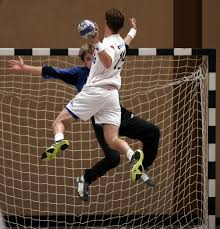

[← Volver al inicio](README.md)
# Temas del curso

### 14/09 · Mis aficiones

Llevo jugando al balonmano desde los ocho años, en el equipo
del pueblo. Lo que más me gusta no es marcar, es el momento
en que sale una jugada que habíamos entrenado veinte veces
y por fin sale. Entreno martes y jueves, y los sábados hay
partido. También llevo dos años tocando la guitarra, aunque
ahí voy mucho más lento: me sé cuatro canciones y media.



Buscando en GitHub he encontrado [Handball](https://github.com//evansloan/sports.py),
un programa libre para escribir temas de balonmano


```
